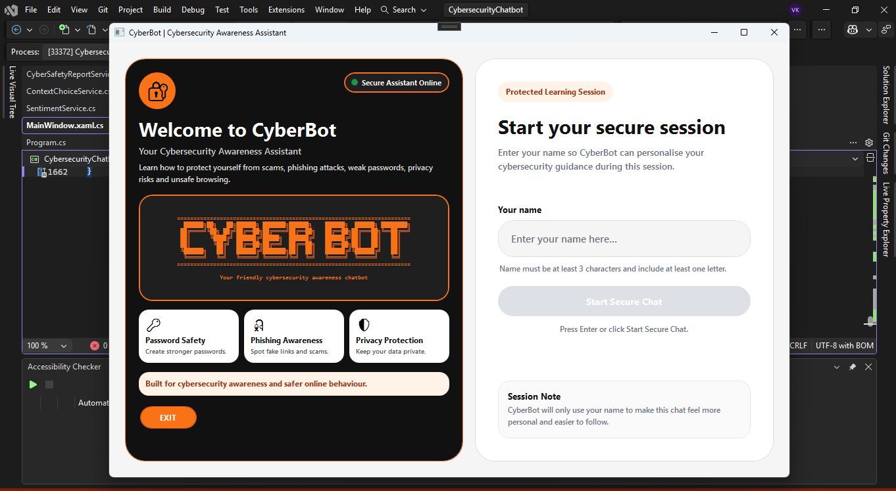
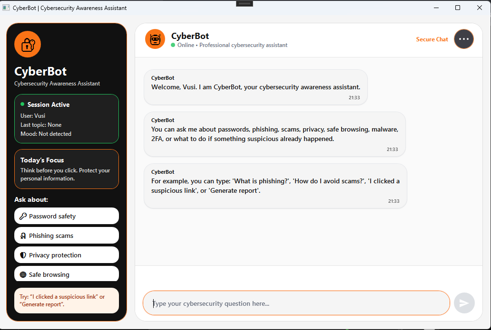
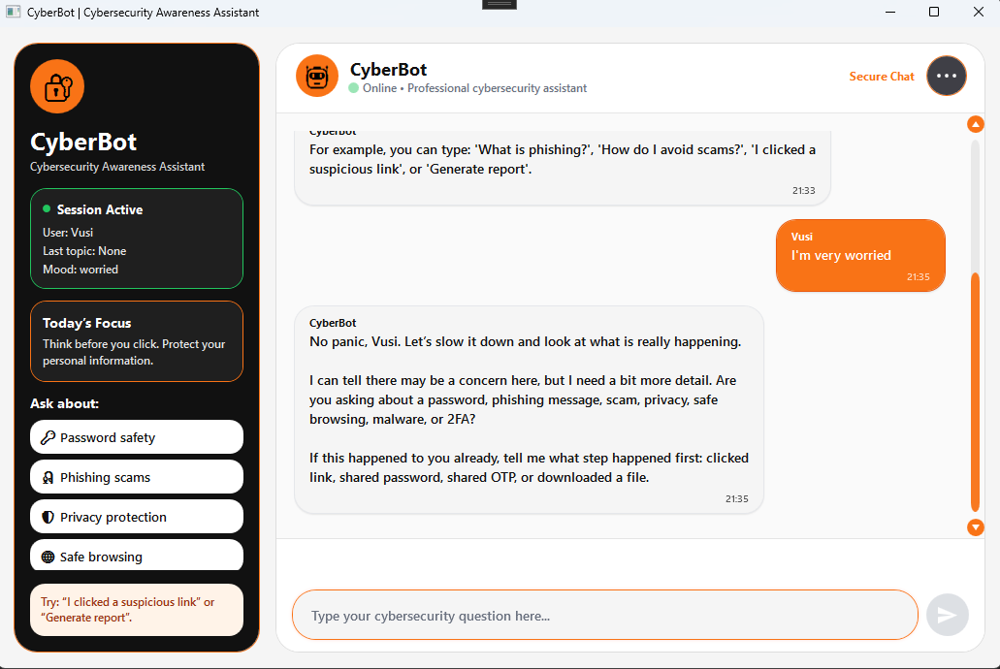
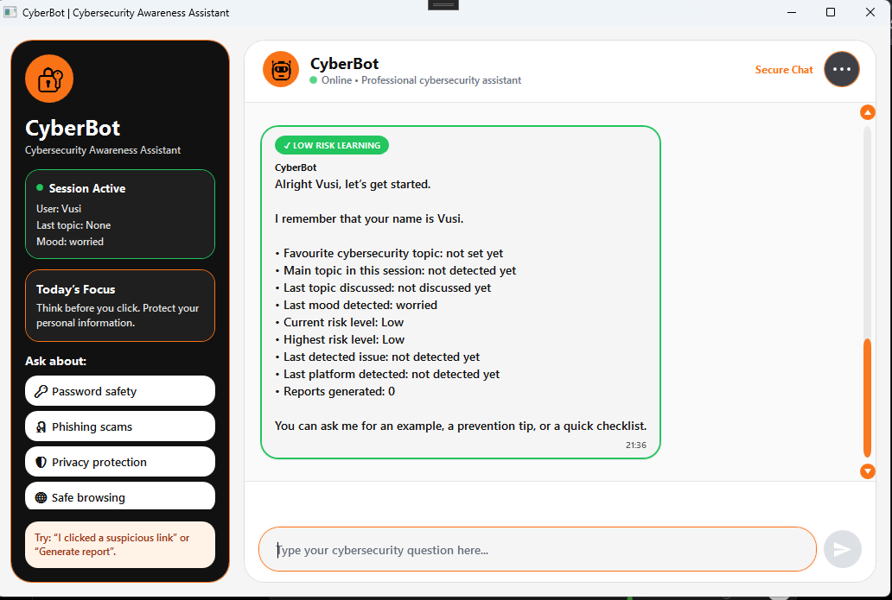
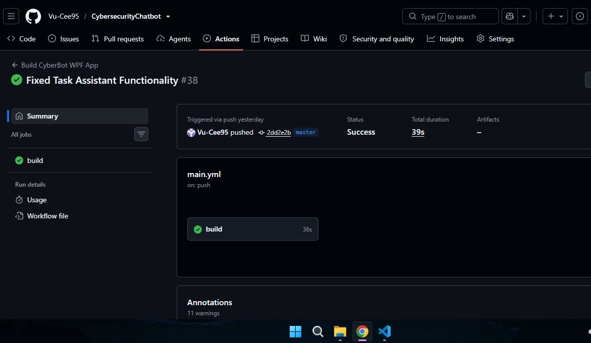

# 🔐 Cybersecurity Awareness Chatbot (Part 1)

## 📌 Project Overview

The **Cybersecurity Awareness Chatbot** is a C# console-based application developed for the **PROG6221 Portfolio of Evidence (Part 1)**.

The purpose of this chatbot is to educate users on important cybersecurity topics such as:

* Password safety
* Phishing awareness
* Safe browsing practices

The chatbot simulates a real-life conversation, providing users with practical advice on how to stay safe online.

---

## 🎯 Objectives

* Create an interactive chatbot using a console application
* Apply string manipulation and input handling
* Implement user-friendly interaction
* Enhance the console UI with multimedia elements
* Structure code using Object-Oriented Programming (OOP)

---

## 🚀 Features

### 🔊 Voice Greeting

* Plays a **WAV audio file** when the application starts
* Welcomes the user with a personalised cybersecurity message

### 🎨 ASCII Art Display

* Displays a cybersecurity-themed ASCII logo at startup
* Enhances the visual appeal of the console interface

### 👤 Personalised User Interaction

* Prompts the user for their name
* Uses the name throughout the conversation

### 💬 Basic Response System

The chatbot responds to:

* "How are you?"
* "What is your purpose?"
* "What can I ask you?"

It also provides guidance on:

* Password safety
* Phishing
* Safe browsing

### ⚠️ Input Validation

* Handles empty input
* Detects unknown queries
* Responds with:
  *"I didn’t quite understand that. Could you rephrase?"*

### 🖥️ Enhanced Console UI

* Uses colours (`Console.ForegroundColor`)
* Includes borders and separators
* Uses spacing for readability
* Simulates typing effect

### 🧠 Code Structure

Organised using:

* Controllers
* Models
* Services
* Views
* Utils

`Program.cs` is kept minimal and clean.

---


## 🧠 Code Quality

The project follows clean coding practices:
- Modular structure using MVC pattern
- Separation of concerns
- Readable and maintainable code
- Use of methods and classes for scalability

---

## 🛠️ Technologies Used

* C#
* .NET Console Application
* System.Media (audio playback)
* Git & GitHub
* GitHub Actions (CI)

---

## 📂 Project Structure

```text
CybersecurityChatbot/
│── README.md
│── .gitignore
│── .gitattributes
│── CybersecurityChatbot.slnx
│
└── CybersecurityChatbot/
    │── Program.cs
    │
    ├── Controllers/
    │   └── ChatbotController.cs
    │
    ├── Models/
    │   ├── User.cs
    │   ├── Message.cs
    │   └── ChatSession.cs
    │
    ├── Services/
    │   ├── ChatbotService.cs
    │   ├── ResponseService.cs
    │   └── NavigationService.cs
    │
    ├── Views/
    │   └── ConsoleView.cs
    │
    ├── Utils/
    │   ├── InputValidator.cs
    │   └── Helper.cs
    │
    └── Assets/
        └── welcome.wav
```

---

## ▶️ How to Run the Project

### Prerequisites

* Visual Studio
* .NET SDK installed

### Steps

1. Clone the repository:

```bash
git clone https://github.com/Vu-Cee95/CybersecurityChatbot.git
```

2. Open the folder:

```bash
cd CybersecurityChatbot
```

3. Open the solution:

* Open `CybersecurityChatbot.slnx` in Visual Studio

4. Build the project:

* Press `Ctrl + Shift + B`

5. Run the application:

* Press `F5`

6. Ensure:

* `welcome.wav` is inside the **Assets** folder

---

## 💡 Example Usage

```text
Bot: Hello! Welcome to the Cybersecurity Awareness Chatbot.
Bot: What is your name?
User: Vusimuzi

Bot: Nice to meet you, Vusimuzi! How can I help you today?

User: Tell me about phishing
Bot: Phishing is a scam where attackers try to trick you into revealing personal information through fake emails or websites.
```

---

## 🔁 GitHub Version Control

This project uses GitHub with meaningful commits.

### Example Commit Messages

* Initial project setup
* Added voice greeting
* Implemented ASCII art
* Added chatbot responses
* Implemented input validation
* Added README and improvements

---

## ⚙️ Continuous Integration (CI)

GitHub Actions is used to:

* Build the project automatically
* Detect errors on each push

### CI Status

```text
[CI STATUS] https://github.com/Vu-Cee95/CybersecurityChatbot/blob/master/GitCIWorkflow.png


```

---

## 🎥 Video Demonstration

```text
Watch the full project walkthrough below:

[YOUTUBE PRESENTATION LINK] https://youtu.be/A_N5yeuaaAg
```

This video includes:

- Program execution
- Code structure explanation
- Logic and flow
- Feature demonstration
---

## ✅ Alignment with Requirements

This project includes:

* Voice greeting
* ASCII art
* Personalised interaction
* Cybersecurity responses
* Input validation
* Enhanced console UI
* Structured code using classes
* GitHub version control
* CI workflow support

---

## ✅ Submission Checklist

* [x] Source code included
* [x] README file included
* [x] WAV audio file included
* [x] ASCII art implemented
* [x] GitHub Actions CI working
* [x] CI screenshot added
* [x] YouTube video link added

---

## 👨‍💻 Author

**Vusimuzi Khanyile**
Diploma in Information Technology (Systems Development)
Rosebank College

---

## 📌 Notes

* This project is for academic purposes
* All work follows academic integrity policies

---

## 🚀 Future Improvements

* GUI (WinForms / WPF)
* Keyword recognition
* Memory & recall
* Sentiment detection
* Cybersecurity quiz
* Task assistant

---

## 📌 Update Log

* README created and structured
* Project prepared for Part 1 submission

---

# 🔐 CyberBot – Cybersecurity Awareness Chatbot (Part 2)

## 📌 Part 2 Project Overview

The **Cybersecurity Awareness Chatbot Part 2** continues from the same GitHub repository used for **Part 1**.

In Part 1, the chatbot was developed as a C# console-based application with a voice greeting, ASCII art, personalised user interaction, basic cybersecurity responses, input validation, and GitHub Actions continuous integration.

For **Part 2**, the chatbot has been extended into a **WPF graphical user interface application** called **CyberBot**. The GUI version keeps the important Part 1 features while adding more advanced chatbot functionality such as keyword recognition, random responses, sentiment detection, memory, conversation flow, and a more professional user interface.

CyberBot helps users learn about cybersecurity topics such as:

* Password safety
* Phishing awareness
* Online scams
* Privacy protection
* Safe browsing
* Malware
* Two-factor authentication

---

## 👨‍💻 Student Details

**Student Name:** Vusimuzi Khanyile  
**Student Number:** ST10468302  
**Module:** Programming 2A  
**Module Code:** PROG6221/w  
**Assessment:** Portfolio of Evidence – Part 2  
**Application Name:** CyberBot  
**Application Type:** WPF Desktop Application  
**Development Environment:** Visual Studio 2022  

---

## 🎯 Part 2 Objectives

The objectives of Part 2 were to:

* Extend the Part 1 console chatbot into a graphical user interface
* Create a WPF desktop application
* Improve the chatbot’s user experience
* Implement keyword recognition
* Add random cybersecurity responses
* Add conversation memory and recall
* Add sentiment detection
* Improve conversation flow
* Use generic collections
* Use delegates
* Maintain clean object-oriented code
* Use GitHub version control with meaningful commits
* Create tagged releases for Part 2
* Show a successful GitHub Actions build

---

# ✅ Part 1 Features Retained in Part 2

The following Part 1 features were carried forward into the Part 2 GUI application.

---

## 🔊 Voice Greeting

CyberBot plays a WAV audio greeting when the application starts.

The audio file is stored in:

```text
CybersecurityChatbotGUI/Assets/welcome.wav
```

The audio playback logic is handled in:

```text
CybersecurityChatbotGUI/Services/AudioPlayer.cs
```

---

## 🎨 ASCII Art Display

The ASCII art from Part 1 is still displayed, but it is now shown inside the WPF welcome page instead of the console.

This keeps the identity of the original chatbot while improving the visual presentation.

---

## 👤 Personalized User Interaction

CyberBot asks the user for their name and uses it later in the conversation.

Example:

```text
Welcome, Vusimuzi. I am CyberBot, your cybersecurity awareness assistant.
```

---

## ⚠️ Input Validation

CyberBot still validates user input and handles unclear, invalid, or empty messages without crashing.

If the bot does not understand the user clearly, it guides the user back to supported cybersecurity topics.

---

# 🚀 Part 2 Features Implemented

---

## 1. Graphical User Interface

CyberBot was upgraded from a console application into a WPF desktop application.

The GUI includes:

* Welcome page
* CyberBot branding area
* ASCII art display
* Name input field
* Main chat screen
* Chat history area
* User and bot message bubbles
* Text input box
* Send button
* Scrollable chat area
* Typing indicator
* Sidebar information panel
* Help menu
* Start New Chat option
* Logout option
* Exit option
* Custom confirmation dialogs

---

## 2. Keyword Recognition

CyberBot recognizes cybersecurity-related keywords and provides relevant responses.

Recognized topics include:

* Password safety
* Phishing
* Online scams
* Privacy protection
* Safe browsing
* Malware
* Two-factor authentication

Keyword recognition is handled by:

```text
CybersecurityChatbotGUI/Services/KeywordService.cs
```

Example:

```text
User: Tell me about password safety.

CyberBot: A strong password should be long, unique, and difficult to guess. Avoid using personal details such as your name or birthday.
```

---

## 3. Random Responses

CyberBot uses randomized responses so that conversations do not feel repetitive.

Each cybersecurity topic has multiple possible responses, and the chatbot randomly selects a suitable response.

Random response logic is mainly handled by:

```text
CybersecurityChatbotGUI/Services/ResponseService.cs
CybersecurityChatbotGUI/Services/PersonalityService.cs
```

This makes the chatbot feel more natural and less predictable.

---

## 4. Conversation Flow

CyberBot remembers the current topic and can continue the conversation when the user asks follow-up questions.

Supported follow-up phrases include:

```text
tell me more
explain more
give me another tip
continue
go deeper
```

Conversation flow is managed through:

```text
CybersecurityChatbotGUI/Models/ConversationState.cs
CybersecurityChatbotGUI/Services/ContextChoiceService.cs
CybersecurityChatbotGUI/Services/ChatbotEngine.cs
```

Example:

```text
User: Tell me about scams.

CyberBot: Scams often use pressure, fake trust, or unrealistic promises to trick people.

User: Tell me more.

CyberBot: Since we are talking about scams, let us go deeper. Scammers usually try to make you act quickly before you think clearly.
```

---

## 5. Memory and Recall

CyberBot stores session-based user information and uses it to personalize responses.

CyberBot can remember:

* User name
* Favorite cybersecurity topic
* Last discussed topic
* Last detected mood or sentiment
* Last detected platform
* Last intent requested

Memory is handled by:

```text
CybersecurityChatbotGUI/Models/UserMemory.cs
```

Example:

```text
User: I am interested in privacy.

CyberBot: Great, Vusimuzi. I will remember that you are interested in privacy.

User: What do you remember about me?

CyberBot: I remember your name and that you are interested in privacy.
```

---

## 6. Sentiment Detection

CyberBot detects basic user emotions and responds with empathy before giving cybersecurity advice.

Detected sentiments include:

* Worried
* Curious
* Frustrated
* Happy
* Neutral

Sentiment detection is handled by:

```text
CybersecurityChatbotGUI/Services/SentimentService.cs
```

Example:

```text
User: I am worried about phishing.

CyberBot: It is understandable to feel worried. Phishing can be dangerous, but you can protect yourself by checking links carefully and never sharing passwords or OTPs.
```

---

## 7. Automatic Tip After Sentiment Detection

CyberBot does not only detect the user’s mood. It also automatically gives a helpful cybersecurity tip after detecting sentiment.

Example:

```text
User: I am worried about phishing.

CyberBot: It is understandable to feel worried. A good safety step is to avoid clicking links in urgent messages. Instead, visit the official website directly and check the message source first.
```

This shows that the chatbot reacts emotionally and gives practical advice immediately.

---

## 8. Error Handling

CyberBot handles invalid, empty, or unclear input without crashing.

Handled cases include:

* Empty input
* Invalid name input
* Unsupported questions
* Short unclear text
* Unknown cybersecurity queries

Validation is handled by:

```text
CybersecurityChatbotGUI/Services/Validator.cs
```

Example:

```text
User: ???

CyberBot: I could not understand that clearly. Try asking about passwords, phishing, scams, privacy, malware, safe browsing, or 2FA.
```

---

## 9. Code Optimization and OOP Structure

The project is structured using separate model and service classes to avoid placing all logic inside `MainWindow.xaml.cs`.

The GUI code handles interface events, animations, input handling, and message rendering, while the chatbot intelligence is handled by separate service classes.

This supports clean code, maintainability, and the Part 2 code optimiZation requirement.

---

# 🛠️ Part 2 Technologies Used

* C#
* WPF / XAML
* .NET Windows Desktop
* Visual Studio 2022
* Object-Oriented Programming
* Generic collections
* Delegates
* WAV audio playback
* Git and GitHub
* GitHub Actions

---

# 💻 Part 2 System Requirements

To run the Part 2 GUI application, you need:

* Windows operating system
* Visual Studio 2022
* .NET Desktop Development workload installed
* .NET 8.0 SDK or compatible Windows desktop framework

Recommended target framework:

```xml
<TargetFramework>net8.0-windows</TargetFramework>
```

If the project uses a different target framework, make sure the matching .NET SDK is installed on the machine running the application.

---

# ▶️ How to Run the Part 2 GUI Application: CybersecurityChatbotGUI

Part 2 of this project is located in the **CybersecurityChatbotGUI** project folder.

This is the WPF graphical version of CyberBot.

---

## Step 1: Clone the Repository

Open Command Prompt, PowerShell, or Git Bash and run:

```bash
git clone https://github.com/Vu-Cee95/CybersecurityChatbot.git
```

---

## Step 2: Open the Project Folder

```bash
cd CybersecurityChatbot
```

---

## Step 3: Open the Solution in Visual Studio

Open the solution file in Visual Studio 2022.

Depending on the current solution file in the repository, open one of the following:

```text
CybersecurityChatbot.sln
```

or:

```text
CybersecurityChatbot.slnx
```

---

## Step 4: Set CybersecurityChatbotGUI as the Startup Project

In **Solution Explorer**, locate the project named:

```text
CybersecurityChatbotGUI
```

Right-click on:

```text
CybersecurityChatbotGUI
```

Then click:

```text
Set as Startup Project
```

This ensures that Visual Studio runs the Part 2 GUI application instead of the original Part 1 console application.

---

## Step 5: Check the Voice Greeting File

Make sure the voice greeting file exists inside the GUI project:

```text
CybersecurityChatbotGUI/Assets/welcome.wav
```

The file must be included in the project so that the voice greeting plays when the GUI application starts.

In the `.csproj` file, it should be included as:

```xml
<Content Include="Assets\welcome.wav">
  <CopyToOutputDirectory>PreserveNewest</CopyToOutputDirectory>
</Content>
```

---

## Step 6: Build the GUI Project

In Visual Studio, click:

```text
Build > Build Solution
```

or press:

```text
Ctrl + Shift + B
```

Wait until Visual Studio confirms that the build succeeded.

---

## Step 7: Run CyberBot GUI

Click the green **Start** button in Visual Studio, or press:

```text
F5
```

The **CybersecurityChatbotGUI** application should launch.

When it opens, it should:

* Play the voice greeting
* Display the CyberBot welcome page
* Show the ASCII art in the GUI
* Ask the user to enter their name
* Open the main chat screen after a valid name is entered

---

## Step 8: Test the GUI Chatbot

After the chat screen opens, test the chatbot using prompts such as:

```text
Tell me about password safety
What is phishing?
I am worried about online scams
Tell me more
What do you remember about me?
```

These prompts demonstrate keyword recognition, sentiment detection, memory, and conversation flow.

---

# 📂 Part 2 Project Structure

```text
CybersecurityChatbot/
│
├── README.md
├── .gitignore
├── .gitattributes
├── GitCIWorkflow.png
├── CybersecurityChatbot.sln / CybersecurityChatbot.slnx
│
├── Screenshots/
│   ├── Cyber1.png
│   ├── Cyber2.png
│   ├── Cyber3.png
│   ├── Cyber4.png
│   └── Cyber5.png
│
├── .github/
│   └── workflows/
│       └── build.yml
│
├── CybersecurityChatbot/
│   └── Part 1 console chatbot files
│
└── CybersecurityChatbotGUI/
    │
    ├── App.xaml
    ├── App.xaml.cs
    ├── MainWindow.xaml
    ├── MainWindow.xaml.cs
    ├── CyberDialog.xaml
    ├── CyberDialog.xaml.cs
    ├── CybersecurityChatbotGUI.csproj
    │
    ├── Assets/
    │   └── welcome.wav
    │
    ├── Models/
    │   ├── ChatHistoryItem.cs
    │   ├── ConversationState.cs
    │   └── UserMemory.cs
    │
    └── Services/
        ├── AudioPlayer.cs
        ├── ChatbotEngine.cs
        ├── ChatHistoryService.cs
        ├── ClarifyingQuestionService.cs
        ├── ContextChoiceService.cs
        ├── CyberSafetyReportService.cs
        ├── InputNormaliZerService.cs
        ├── KeywordService.cs
        ├── PersonalityService.cs
        ├── PlatformExampleService.cs
        ├── ResponseService.cs
        ├── RiskLevelService.cs
        ├── SentimentService.cs
        └── Validator.cs
```

---

# 🧠 Part 2 Code Structure Explanation

## MainWindow.xaml

This file contains the WPF user interface layout.

It includes:

* Welcome page
* ASCII art display
* Name input field
* Main chat screen
* Chat history area
* Input box
* Send button
* Sidebar
* Menu options
* Loading overlay

---

## MainWindow.xaml.cs

This file handles GUI-related behavior.

It controls:

* Button clicks
* TextBox events
* Page transitions
* Chat bubble rendering
* Typing indicator
* Input glow effects
* Logout and exit confirmation dialogs

The main chatbot intelligence is not stored in this file. The chatbot logic is separated into service classes.

---

## ChatbotEngine.cs

This is the main class that processes user input and routes it to the correct chatbot logic.

It connects:

* Keyword recognition
* Sentiment detection
* Memory
* Conversation state
* Follow-up handling
* Response generation

---

## KeywordService.cs

This class detects cybersecurity keywords from user messages.

It recogniZes topics such as:

* password
* phishing
* scam
* privacy
* safe browsing
* malware
* 2FA

---

## ResponseService.cs

This class stores and returns cybersecurity responses.

It supports random response selection so the bot does not always return the same answer.

---

## SentimentService.cs

This class detects user emotion.

It checks whether the user sounds:

* worried
* curious
* frustrated
* happy
* neutral

---

## UserMemory.cs

This model stores session-based memory.

It stores:

* user name
* favorite topic
* last topic
* last sentiment
* last platform
* last intent

---

## Validator.cs

This service validates input.

It checks:

* empty messages
* invalid names
* unclear input
* meaningless input

---

# 🧩 Use of Generic Collections

The application uses generic collections such as:

```csharp
List<string>
Dictionary<string, List<string>>
```

These collections are used for:

* Storing cybersecurity responses
* Mapping keywords to responses
* Selecting random responses
* Tracking chat history
* Managing conversation context
* OrganiZing sentiment trigger words

This supports the Part 2 requirement to use generic collections effectively.

---

# 🔁 Use of Delegates

The application uses a delegate in the chatbot engine to support response routing.

Example:

```csharp
private delegate string ResponseHandler(string userInput);
```

The delegate helps separate input processing from response generation.

This supports the Part 2 requirement to use delegates.

---

# 💡 Part 2 Example Test Prompts

Use the following prompts to test CyberBot.

---

## Basic Interaction

```text
Hello
How are you?
What can I ask you about?
What is your purpose?
```

---

## Password Safety

```text
Tell me about password safety.
How do I create a strong password?
Give me a password tip.
```

---

## Phishing

```text
What is phishing?
Give me a phishing tip.
Show me a phishing example.
```

---

## Online Scams

```text
I am worried about online scams.
How do I avoid scams?
Tell me more.
Give me another scam tip.
```

---

## Privacy

```text
I am interested in privacy.
How do I protect my privacy online?
What do you remember about me?
```

---

## Safe Browsing

```text
How do I browse safely?
What should I check before clicking a link?
```

---

## Malware

```text
What is malware?
How can I avoid downloading malware?
```

---

## Two-Factor Authentication

```text
What is 2FA?
Why should I use two-factor authentication?
```

---

## Sentiment Detection

```text
I am worried about phishing.
I am confused about scams.
I am curious about malware.
I am frustrated because I do not understand safe browsing.
```

---

## Error Handling

```text
???
asdf
123
```

---

# 🖼️ Part 2 Screenshots

Screenshots are stored in the root repository folder under:

```text
Screenshots/
```

## Welcome Page Screenshot



## Chat Screen Screenshot



## Keyword Recognition Screenshot



## Sentiment Detection Screenshot



## Memory Recall Screenshot


## GitHub Actions Green Tick Screenshot



---

# ⚙️ Part 2 Continuous Integration

GitHub Actions is used to build the project automatically and check that the project compiles successfully.

Workflow file location:

```text
.github/workflows/build.yml
```

The GitHub Actions tab shows a successful green tick on the latest commit before final submission.

---

# 🔁 Part 2 GitHub Version Control

This project uses the same GitHub repository from Part 1.

Part 2 commits show the development progress from console chatbot to WPF GUI chatbot.

The repository contains at least six meaningful commits for Part 2.

Part 2 commit examples include:

```text
feat: Add WPF GUI for Part 2 chatbot
feat: Design chatbot GUI with welcome page and chat screen
feat: Add keyword recognition and random cybersecurity responses
feat: Add sentiment detection and user memory
feat: Improve conversation flow and follow-up handling
docs: Update README for Part 2 submission
```

---

# 🏷️ Part 2 Releases and Tags

Part 2 includes two tagged releases.

Required releases:

```text
v2.0 - Part 2 GUI initial release
v2.1 - Memory and sentiment detection release
```

Release notes for `v2.0`:

```text
Part 2 initial release. Includes WPF GUI, voice greeting, ASCII art, keyword recognition, random responses, and main chat interface.
```

Release notes for `v2.1`:

```text
Added memory and sentiment detection features. Improved conversation flow, follow-up handling, personaliZed responses, and error handling.
```

---

# 🎥 Part 2 Video Presentation

Part 2 requires a video presentation with the student's own voice.

YouTube unlisted video link:

```text
https://youtu.be/ZJurR56743o
```

The video demonstrates:

1. Launching the app
2. Voice greeting playing
3. ASCII art displaying in the GUI
4. Name input and personaliZed greeting
5. At least three keyword examples
6. Random responses
7. Sentiment detection
8. The bot automatically giving a tip after sentiment detection
9. Memory and recall
10. Follow-up flow using phrases like `tell me more`
11. Error handling
12. Project structure and important classes
13. GitHub commit history
14. Two tagged releases
15. GitHub Actions green tick

---

# ✅ Part 2 Requirement Mapping

| Part 2 Requirement | Implementation in CyberBot |
|---|---|
| GUI Design | WPF interface in `MainWindow.xaml` |
| Voice Greeting | `CybersecurityChatbotGUI/Assets/welcome.wav` and `AudioPlayer.cs` |
| ASCII Art | Welcome page ASCII display |
| PersonaliZed Responses | User name captured and used in responses |
| Keyword Recognition | `KeywordService.cs` detects cybersecurity topics |
| Random Responses | `ResponseService.cs` and response lists |
| Conversation Flow | `ConversationState.cs`, `ContextChoiceService.cs`, and `ChatbotEngine.cs` |
| Memory and Recall | `UserMemory.cs` |
| Sentiment Detection | `SentimentService.cs` |
| Error Handling | `Validator.cs` and fallback responses |
| Generic Collections | Lists and dictionaries used for responses and state |
| Delegates | Response handler delegate in chatbot engine |
| Code OptimiZation | Logic separated into Models and Services |
| GitHub Releases | Tagged releases `v2.0` and `v2.1` |
| Correct Submission | README, GitHub link, ZIP backup, screenshots, and YouTube link |

---

# ✅ Part 2 README Requirements Checklist

This README includes the required Part 2 submission items:

* [x] Project title and one-sentence description
* [x] Student name and student number
* [x] List of all features implemented in Part 2
* [x] Step-by-step instructions for cloning and running the project
* [x] Step-by-step instructions for running `CybersecurityChatbotGUI`
* [x] Prerequisites: Visual Studio 2022, .NET 8.0, Windows
* [x] Location of the `welcome.wav` file for the voice greeting
* [x] Screenshot section for the running GUI
* [x] YouTube video link
* [x] Screenshot section for GitHub Actions green tick

---

# ✅ Part 2 Final Submission Checklist

Before submitting, confirm that every item below is complete.

```text
[x] Project compiles and runs without errors in Visual Studio 2022
[x] CybersecurityChatbotGUI is used as the Part 2 startup project
[x] Voice greeting plays on launch
[x] ASCII art appears in the GUI
[x] User is asked for their name on first launch
[x] Bot uses the name in later responses
[x] At least 5 keywords are recogniZed with relevant responses
[x] Each keyword has multiple responses that vary randomly
[x] Sentiment detection works for worried, curious, and frustrated
[x] Bot automatically gives a tip after detecting sentiment
[x] Follow-up phrases like "tell me more" continue the current topic
[x] Fallback response handles unrecogniZed input without crashing
[x] Logic is not all stored in MainWindow.xaml.cs
[x] Models and Services folders are included
[x] GitHub repository is public
[x] At least 6 meaningful Part 2 commits are visible
[x] Two tagged releases exist: v2.0 and v2.1
[x] README is complete
[x] GitHub Actions shows a green tick
[x] welcome.wav is included in the repo and ZIP
[x] welcome.wav copies to the output directory
[x] bin/ and obj/ folders are not included in the repo
[x] ZIP opens in Visual Studio and compiles without errors
[x] GitHub link works in an incognito/private browser
[x] YouTube video is unlisted, not private
[x] YouTube link is inside the README
[x] YouTube link is submitted on ARC
[x] GitHub link is submitted on ARC
[x] ZIP backup is submitted on ARC
```

---

# 📌 Part 2 Update Log

* Converted chatbot into WPF GUI application
* Added welcome page and chat screen
* Added message bubbles and input controls
* Added keyword recognition
* Added random responses
* Added sentiment detection
* Added memory and recall
* Added conversation flow
* Added custom dialogs
* Updated README for Part 2 submission
* Added tagged releases for Part 2
* Added Part 2 YouTube video presentation
# 🔐 CyberBot – Cybersecurity Awareness Chatbot (Part 3)

## 📌 Project Overview

**CyberBot** is a WPF desktop application developed for the **PROG6221 Portfolio of Evidence (Part 3)**. It combines a conversational cybersecurity chatbot with a task management system, interactive quiz, natural language processing simulation, and comprehensive activity logging — all backed by a MySQL database.

The application helps users learn about cybersecurity topics such as password safety, phishing awareness, online scams, privacy protection, safe browsing, malware, and two-factor authentication, while also providing practical tools to manage their cybersecurity learning tasks.

---

## 👨‍💻 Student Details

| Field | Detail |
|-------|--------|
| **Student Name** | Vusimuzi Khanyile |
| **Student Number** | ST10468302 |
| **Module** | Programming 2A |
| **Module Code** | PROG6221/w |
| **Assessment** | Portfolio of Evidence – Part 3 |
| **Application Name** | CyberBot |
| **Application Type** | WPF Desktop Application |
| **Development Environment** | Visual Studio 2022 |

---

## 🎯 Part 3 Objectives

The objectives of Part 3 were to:

- Extend the existing WPF chatbot with advanced features
- Integrate a MySQL database for persistent task storage
- Implement a full-featured task assistant with reminders
- Create an interactive cybersecurity quiz mini-game
- Simulate natural language processing for command detection
- Build a comprehensive activity logging system
- Maintain a professional, premium GUI with tabbed navigation
- Use GitHub version control with meaningful commits
- Create tagged releases for Part 3
- Show a successful GitHub Actions CI build

---

## 🚀 Features

### ✅ Parts 1 & 2 Features Retained

| Feature | Description |
|---------|-------------|
| 🔊 Voice Greeting | Plays WAV audio on application launch |
| 🎨 ASCII Art Display | Cybersecurity-themed ASCII logo on welcome page |
| 👤 Personalised Interaction | User name captured and used throughout |
| 💬 Keyword Recognition | Detects cybersecurity topics in user messages |
| 🎲 Random Responses | Multiple responses per topic for natural conversation |
| 🧠 Memory & Recall | Remembers user preferences and conversation context |
| 😊 Sentiment Detection | Detects user emotion and responds with empathy |
| ✅ Input Validation | Handles empty, invalid, and unclear input gracefully |
| 🖥️ Professional GUI | Premium WPF interface with animations and styling |

### 🆕 Part 3 Features

| Feature | Description |
|---------|-------------|
| 📋 Task Assistant | Add, edit, complete, and delete cybersecurity tasks |
| ⏰ Reminders | Set reminders for tasks (days, weeks, specific dates) |
| 🗄️ MySQL Database | Persistent storage for all tasks |
| 🎮 Cybersecurity Quiz | 14 interactive questions with instant feedback |
| 🏆 Leaderboard | Top 10 rankings with medal colors and tie handling |
| 🧠 NLP Simulation | Natural language command detection with regex |
| 📊 Activity Log | Tracks all user actions with timestamps |
| 🔄 Tabbed Interface | Chat, Tasks, Quiz, and Activity Log tabs |
| 🎨 Premium UI | Orange-themed design with animations and glow effects |
| 🏷️ GitHub Releases | 3 tagged releases (v1.0.0, v1.1.0, v2.0.0) |

---

## 🛠️ Technologies Used

| Technology | Purpose |
|------------|---------|
| C# | Primary programming language |
| WPF / XAML | Graphical user interface |
| .NET 8.0 | Application framework |
| MySQL | Database storage |
| MySql.Data (NuGet) | MySQL connector for .NET |
| Regular Expressions | NLP pattern matching |
| Git & GitHub | Version control |
| GitHub Actions | Continuous integration |
| Visual Studio 2022 | Development environment |

---

## 📂 Project Structure

```text
CybersecurityChatbot/
│
├── README.md
├── .gitignore
├── .gitattributes
├── GitCIWorkflow.png
├── CybersecurityChatbot.sln
│
├── Screenshots/
│   ├── Part3_Tasks.png
│   ├── Part3_Quiz.png
│   ├── Part3_Leaderboard.png
│   ├── Part3_ActivityLog.png
│   └── Part3_Chat.png
│
├── .github/
│   └── workflows/
│       └── build.yml
│
├── CybersecurityChatbot/
│   └── Part 1 console chatbot files
│
└── CybersecurityChatbotGUI/
    │
    ├── App.xaml
    ├── App.xaml.cs
    ├── App.config
    ├── MainWindow.xaml
    ├── MainWindow.xaml.cs
    ├── CyberDialog.xaml
    ├── CyberDialog.xaml.cs
    ├── CybersecurityChatbotGUI.csproj
    │
    ├── Assets/
    │   └── welcome.wav
    │
    ├── Models/
    │   ├── ChatHistoryItem.cs
    │   ├── ConversationState.cs
    │   └── UserMemory.cs
    │
    └── Services/
        ├── AudioPlayer.cs
        ├── ChatbotEngine.cs
        ├── ChatHistoryService.cs
        ├── ClarifyingQuestionService.cs
        ├── ContextChoiceService.cs
        ├── CyberSafetyReportService.cs
        ├── DatabaseHelper.cs          ← Part 3
        ├── TaskAssistant.cs           ← Part 3
        ├── QuizManager.cs             ← Part 3
        ├── NLPSimulator.cs            ← Part 3
        ├── ActivityLogger.cs          ← Part 3
        ├── LeaderboardService.cs      ← Part 3
        ├── InputNormaliserService.cs
        ├── KeywordService.cs
        ├── PersonalityService.cs
        ├── PlatformExampleService.cs
        ├── ResponseService.cs
        ├── RiskLevelService.cs
        ├── SentimentService.cs
        └── Validator.cs
🗄️ Database Setup
Prerequisites
MySQL Server 8.0 or later

MySQL Workbench (optional, for running SQL scripts)

Step 1: Create the Database
Run the following SQL script in MySQL Workbench or any MySQL client:

sql
CREATE DATABASE IF NOT EXISTS cybersecurity_chatbot;
USE cybersecurity_chatbot;

CREATE TABLE IF NOT EXISTS Tasks (
    TaskID INT AUTO_INCREMENT PRIMARY KEY,
    Title VARCHAR(255) NOT NULL,
    Description TEXT,
    ReminderDate DATETIME NULL,
    IsCompleted BOOLEAN DEFAULT FALSE,
    CreatedDate DATETIME DEFAULT CURRENT_TIMESTAMP
);

CREATE TABLE IF NOT EXISTS Leaderboard (
    ScoreID INT AUTO_INCREMENT PRIMARY KEY,
    PlayerName VARCHAR(50) NOT NULL,
    Score INT NOT NULL,
    TotalQuestions INT NOT NULL,
    Percentage DECIMAL(5,2) NOT NULL,
    PlayedDate DATETIME DEFAULT CURRENT_TIMESTAMP
);
Step 2: Configure Connection String
The connection string is stored in CybersecurityChatbotGUI/App.config:

xml
<connectionStrings>
    <add name="ChatbotDB"
         connectionString="Server=localhost;Database=cybersecurity_chatbot;Uid=root;Pwd=@Khanyile95;"
         providerName="MySql.Data.MySqlClient" />
</connectionStrings>
Step 3: Install NuGet Package
In Visual Studio Package Manager Console:

text
Install-Package MySql.Data
▶️ How to Run the Application
Prerequisites
Windows operating system

Visual Studio 2022

.NET Desktop Development workload installed

.NET 8.0 SDK

MySQL Server 8.0+ running locally

Steps
Step 1: Clone the Repository
bash
git clone https://github.com/Vu-Cee95/CybersecurityChatbot.git
Step 2: Open the Project
bash
cd CybersecurityChatbot
Open CybersecurityChatbot.sln in Visual Studio 2022.

Step 3: Set Startup Project
In Solution Explorer, right-click on CybersecurityChatbotGUI and select "Set as Startup Project".

Step 4: Configure Database
Ensure MySQL is running

Run the SQL script above to create the database and tables

Update the connection string in App.config with your MySQL password

Step 5: Build the Project
text
Ctrl + Shift + B
Step 6: Run the Application
text
F5
Step 7: Verify Launch
The application should:

Play the voice greeting

Display the welcome page with ASCII art

Prompt for your name

Open the main chat interface with all Part 3 features

💡 Example Usage
Chat with Cybersecurity Topics
text
User: What is phishing?
CyberBot: Phishing is a type of cyber attack where attackers send fraudulent
          messages designed to trick you into revealing sensitive information.

User: Tell me more
CyberBot: Since we are talking about phishing, let us go deeper...
Task Management
text
User: Add task to enable two-factor authentication
CyberBot: Task added successfully.

User: Add task to review privacy settings remind me in 3 days
CyberBot: Task added with reminder set for 2026-06-29.

User: View tasks
CyberBot: Your Tasks:
          Task 1: Enable two-factor authentication
          Task 2: Review privacy settings | Reminder: 2026-06-29

User: Complete task 1
CyberBot: Task marked as complete.

User: Delete task 2
CyberBot: Task deleted successfully.
Quiz
text
User: Start quiz

Question 1 of 10:
What should you do if you receive an email asking for your password?
A) Reply with your password
B) Click the link to verify
C) Report it as phishing and delete it
D) Forward it to friends

Answer: C
Feedback: Correct! Final Score: 8/10 (80%)
Leaderboard
text
User clicks "View Leaderboard"

Rank  Player        Score   %
1     Vusimuzi      10/10   100%
2     John          8/10    80%
3     Jane          7/10    70%
Activity Log
text
User: Show activity log

Activity Log (Last 10 actions):
1. [14:30] [Task] Task added: 'Enable two-factor authentication'
2. [14:25] [Quiz] Quiz started
3. [14:20] [NLP] Detected intent 'add_task'
4. [14:15] [System] User 'Vusimuzi' logged in
🧠 Code Structure Explanation
DatabaseHelper.cs
Handles all MySQL database operations:

AddTask() - Insert new task

GetAllTasks() - Retrieve all tasks

GetPendingTasks() - Retrieve incomplete tasks

MarkTaskAsComplete() - Update task status

DeleteTask() - Remove task

TestConnection() - Verify database connectivity

TaskAssistant.cs
Manages task operations:

AddTask() - Creates task with optional reminder

ViewAllTasks() - Returns formatted task list

CompleteTask() - Marks task as done

DeleteTask() - Removes task

ParseReminderDate() - Extracts reminder dates from natural language

QuizManager.cs
Manages quiz logic with 14 questions across 6 cybersecurity topics:

Phishing (3 questions)

Password Safety (3 questions)

Safe Browsing (2 questions)

Social Engineering (2 questions)

General Cybersecurity (2 questions)

Malware (2 questions)

NLPSimulator.cs
Simulates natural language processing for command detection:

Pattern matching with keyword dictionaries

Regular expression fallback detection

Intent mapping for 8 command types

ActivityLogger.cs
Tracks all user actions with timestamps and action type labels.

LeaderboardService.cs
Manages quiz leaderboard:

Stores scores in MySQL

Keeps top 10 entries

Handles tie rankings (shared positions)

Auto-cleanup of old scores

🧩 Use of Generic Collections
The application uses generic collections throughout:

csharp
List<TaskItem>              // Task storage
List<QuizQuestion>          // Quiz question bank
List<ActivityEntry>         // Activity log entries
List<LeaderboardEntry>      // Leaderboard entries
List<string>                // Response options, intent patterns
Dictionary<string, List<string>>  // Intent-to-keyword mapping
🔁 Use of Delegates
The chatbot engine uses a delegate for response handling:

csharp
private delegate string ResponseHandler(string userInput);
This separates input processing from response generation.

🖼️ Part 3 Screenshots
Welcome Page
https://Screenshots/Cyber1.png

Chat Interface
https://Screenshots/Part3_Chat.png

Task Assistant
https://Screenshots/Part3_Tasks.png

Cybersecurity Quiz
https://Screenshots/Part3_Quiz.png

Leaderboard
https://Screenshots/Part3_Leaderboard.png

Activity Log
https://Screenshots/Part3_ActivityLog.png

⚙️ Continuous Integration (CI)
GitHub Actions is configured to build the project automatically on every push and pull request.

Workflow File
Location: .github/workflows/build.yml

What It Does
Checks out the repository

Sets up .NET 8.0

Restores NuGet dependencies

Builds the solution in Release configuration

Checks for syntax errors

CI Status
https://GitCIWorkflow.png

🔁 GitHub Version Control
Part 3 Commit History
#	Commit Message
1	Initial commit: Project structure and base files
2	Added Task Assistant with MySQL database integration
3	Implemented Quiz Mini-Game with 10+ cybersecurity questions
4	Added NLP simulation with keyword detection and phrase handling
5	Implemented Activity Log feature tracking all user actions
6	Final integration: Combined Parts 1, 2, and 3 with full GUI
🏷️ Part 3 Releases
Tag	Title	Description
v1.0.0	Initial Part 3 Release	Database integration and task CRUD operations
v1.1.0	Quiz and NLP Features	Quiz mini-game and NLP command detection
v2.0.0	Final Release	Complete application with all Part 3 features
🎥 Part 3 Video Presentation
text
https://youtu.be/YOUR_PART3_VIDEO_LINK
What the Video Covers
Introduction to CyberBot

Code structure walkthrough

Task Assistant demo (add, edit, complete, delete tasks)

Quiz mini-game demo (questions, feedback, scoring)

Leaderboard demo

NLP simulation demo (varied phrasing detection)

Activity Log demo

Database integration explanation

GitHub commits and releases overview

CI workflow green tick verification

✅ Part 3 Requirement Mapping
Requirement	Implementation
GUI Application	WPF application in MainWindow.xaml
Working Code	Build verified with zero errors
GitHub Used	Repository with 6+ commits
MySQL Database	cybersecurity_chatbot with Tasks and Leaderboard tables
Task Assistant	Add, edit, complete, delete tasks with reminders
Database CRUD	Full Create, Read, Update, Delete operations
Cybersecurity Quiz	14 questions with feedback, scoring, and leaderboard
NLP Simulation	Keyword detection and intent mapping
Activity Log	Tracks all user actions with timestamps
Parts 1, 2, 3 Combined	All features integrated in single GUI
6+ Meaningful Commits	Documented commit history
3+ Tagged Releases	v1.0.0, v1.1.0, v2.0.0
CI Workflow	GitHub Actions with green check
Video Presentation	YouTube video with own voice
📋 Submission Checklist
text
[x] Source code pushed to GitHub
[x] README.md complete with all sections
[x] App.config with connection string
[x] MySQL database created and tested
[x] All Part 3 services implemented
[x] MainWindow.xaml updated with tabs
[x] MainWindow.xaml.cs integrated
[x] 6+ meaningful commits
[x] 3 tagged releases created
[x] CI workflow passing (green check)
[x] WAV audio file included
[x] ASCII art displayed
[x] GitHub link works
[x] YouTube video recorded
[x] Application compiles without errors
[x] Application runs without crashing
👨‍💻 Author
Vusimuzi Khanyile
Student Number: ST10468302
Diploma in Information Technology (Systems Development)
Rosebank College

📌 Notes
This project is for academic purposes as part of the PROG6221 Portfolio of Evidence

All work follows academic integrity policies

The application requires MySQL Server to be running locally for database features

📌 Update Log
Part	Update
Part 1	Console chatbot with voice greeting, ASCII art, basic responses
Part 2	WPF GUI with keyword recognition, sentiment detection, memory
Part 3	MySQL database, task assistant, quiz, NLP, leaderboard, activity log